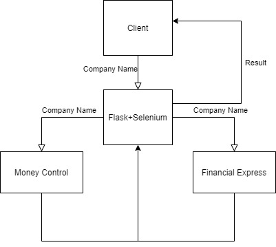
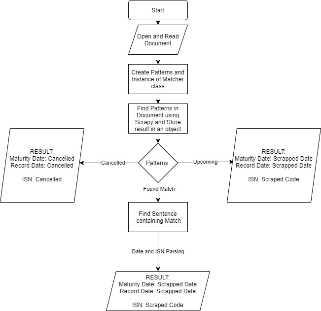
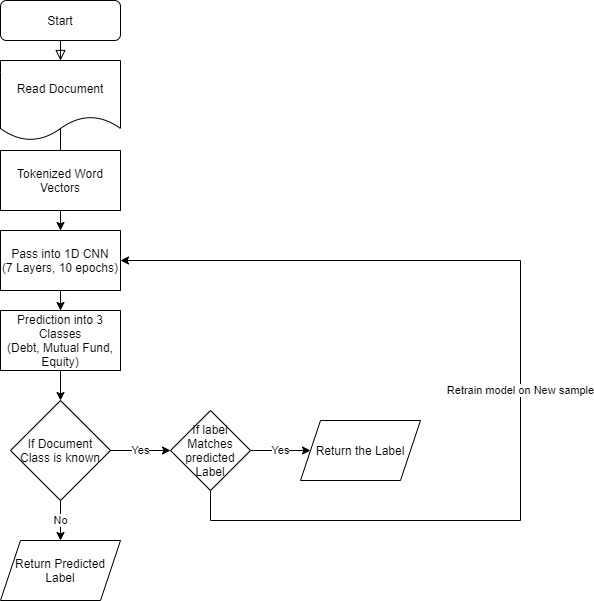
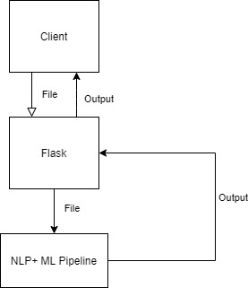
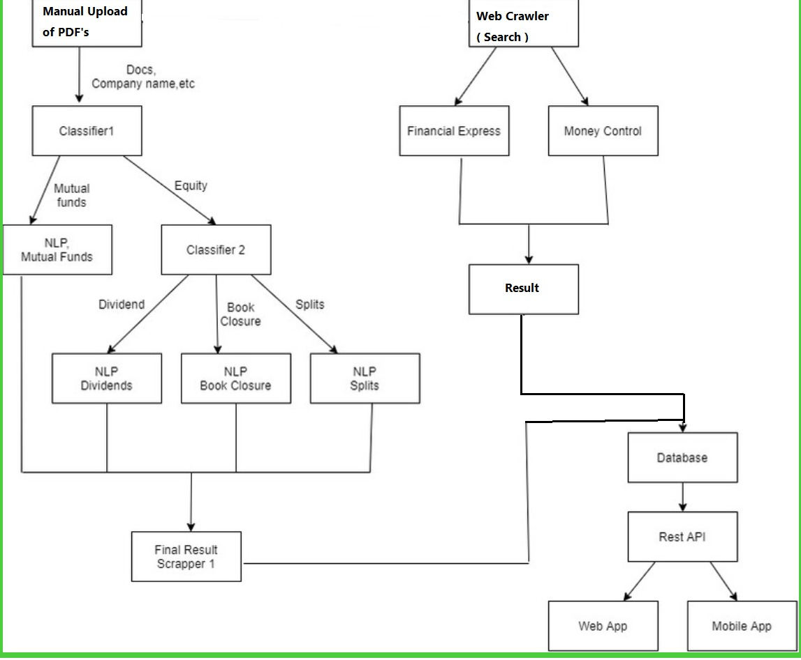
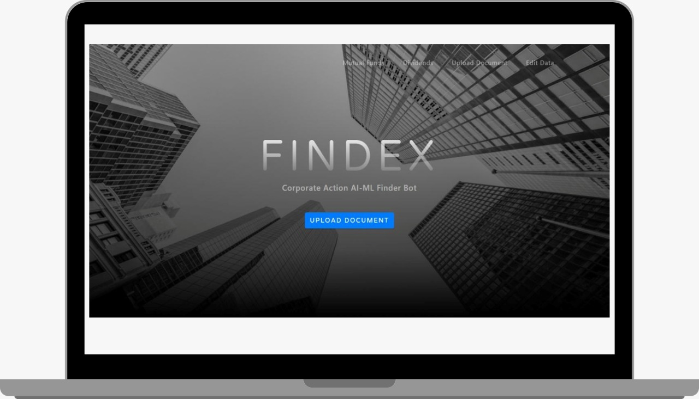
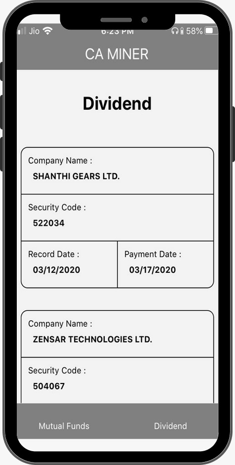

# Findex

## Problem Statement

Companies have to inform stock exchanges about
the corprate actions of the securities that are listed
on the exchange.
The same data is available on other websites in an
unstructured form.
In this problem statement we have to provide a
solution so that we can gather corporate action data
from uppaid sources.
//image

## Our Solution

Corporate action Miner Bot based on AI-ML.

### Web Crawler

User can search for a company and the crawler crawls through Financial Express and Money Control websites to search for the desired company name and most recent corporate actions.



### Manual Upload

1. Segment Classifier

   - The uploaded document is first classified into
     three major segments.
     - Equity
     - Mutual Funds
     - Debt
   - Algorithm - XGboost
   - Accuracy - 86.7%

   

2. Equity Classifier

   - Documents are further subclassified into:
     - Dividend
     - Book Closures
     - Stock Splits
   - Algorithm - Adaptive 1-D Convolutional Neural Network
   - Accuracy - 91.2%

   

3. NLP Models

   - Specific Details are extracted from the document for each class.
   - Algorithm - Trained Named Entity Recognition model in spacy for extracting relevant details.

4. Cloud Database

   - Final Corporate Action Details are uploaded to a MongoDB Cloud Instance.

5. Client Side

   - NodeJS REST-API connects to the MongoDB Cloud Instance and fetches and serves the data to the Client application.

   

## Architecture



 

# Built With

## **Client Side Tech-Stack**

    - NodeJs
    - ReactJs
    - React Native
    - MongoDB
    - AWS

## **Pipeline Tech-Stack**

    - Tensorflow
    - Flask
    - Spacy
    - Selenium
    - Scikit Learn

## Getting Started

Follow the instructions present in the README files inside each folder of the project.

### Prerequisites

You need to have anaconda, nodejs, npm installed as a prerequisite. Also you need to create and activate the anaconda virtual environment first.

```
conda env create --file findex_env.yml
conda activate findex_env

As a sudo/admin user run:
python -m spacy download en

```

# Performance

- Segment Classifier Accuracy - 86.7%
- Equity Classifer Accuracy - 91.2%

# Our Website

   [FinDex](http://35.154.254.195:3000/)

# Future Scope

We aim to develop, not only a small solution
but a whole mobile-first, cloud-first and
completely automated product for small
capped investors.

For enterprises, we aim to provide a flexible
product with plug and play modules to develop
a robust and automated solution.

# Acknowledgements

   [Spacy]https://spacy.io/usage/training
   [Bse]https://www.bseindia.com/corporates/ann.html
   [Hkex]https://www1.hkexnews.hk/search/titlesearch.xhtml?lang=en
   [PyMuPdf]https://pymupdf.readthedocs.io/en/latest/
   [Selenium]https://selenium-python.readthedocs.io/
